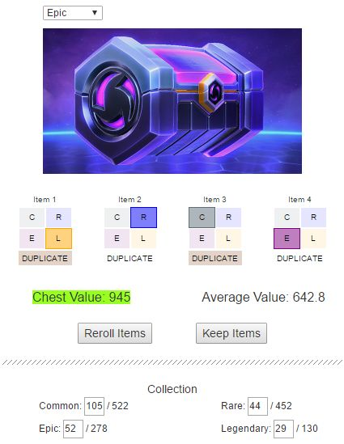

# HotS Reroll Calc (Discontinued)
Helps determine when to consider rerolling loot chests.

Web app can be found at https://freezard.github.io/hots-reroll-calc/

## FEATURES
- Displays the effective amount of shards you will receive from a loot chest.
- Choose from all types of chests in the game.
- Lets you specify the amount of items you own of each rarity.
- Your collection is used when calculating the average amount of shards a loot chest will contain.
- Comparing the two values will help you determine whether to reroll the chest or not.
- Your collection is saved locally in the browser.
- Supports all modern browsers and devices such as iPhone/iPad.

## USAGE
- In the Collection section, enter how many items you've got of each rarity.
- Select the type of chest you're opening from the drop-down menu.
- Enter the contents of the chest you've opened by clicking on the different boxes.
  C = Common R = Rare E = Epic L = Legendary
- Specify whether the items you got were duplicates or not by clicking on the DUPLICATES boxes.
- The chest value (in shards) will be compared to the average chest value. If it's lower, consider rerolling.
- Pressing the Keep Items button will add any new items from the chest to your collection.
- Pressing the Reroll Items button will discard the items.
